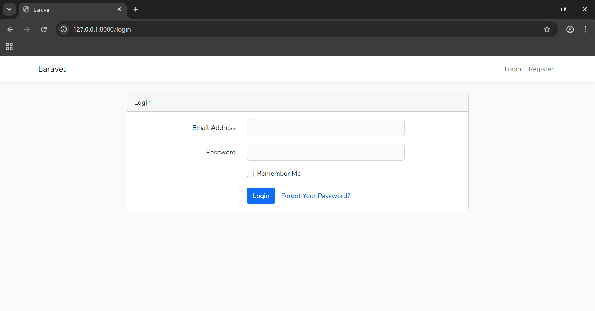
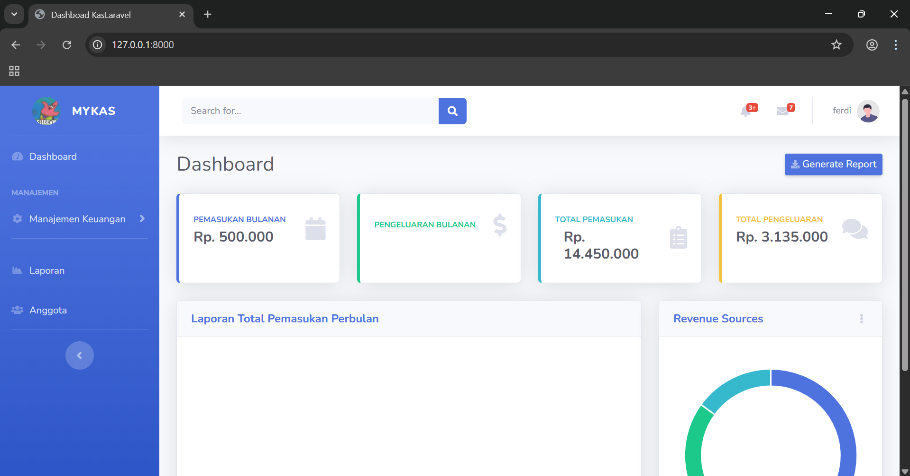
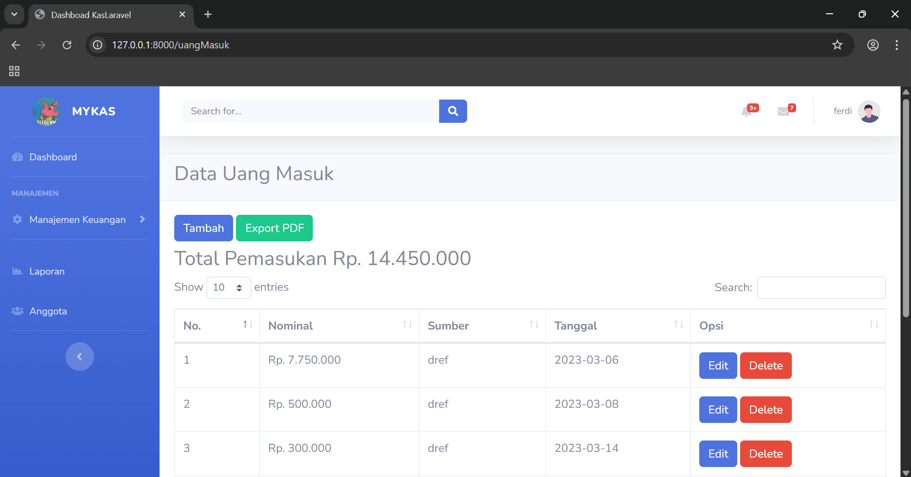
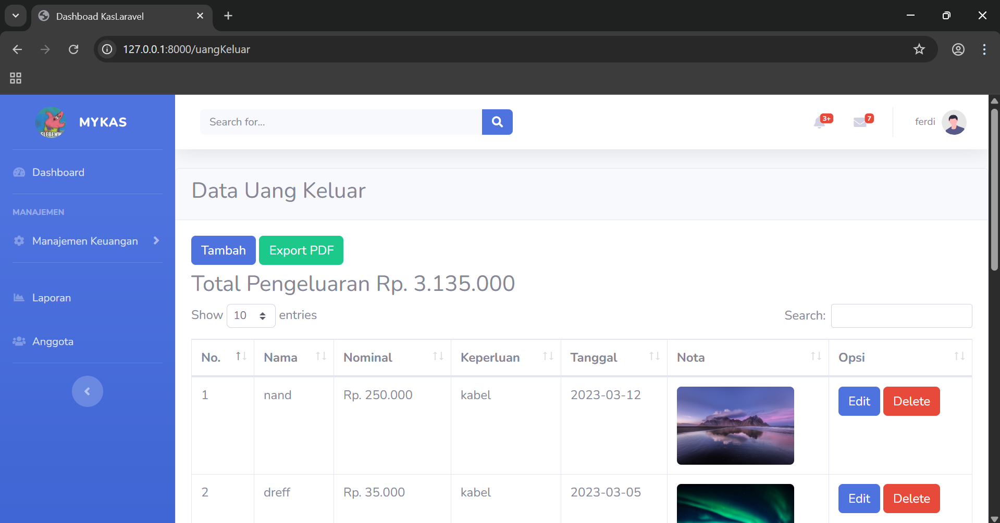
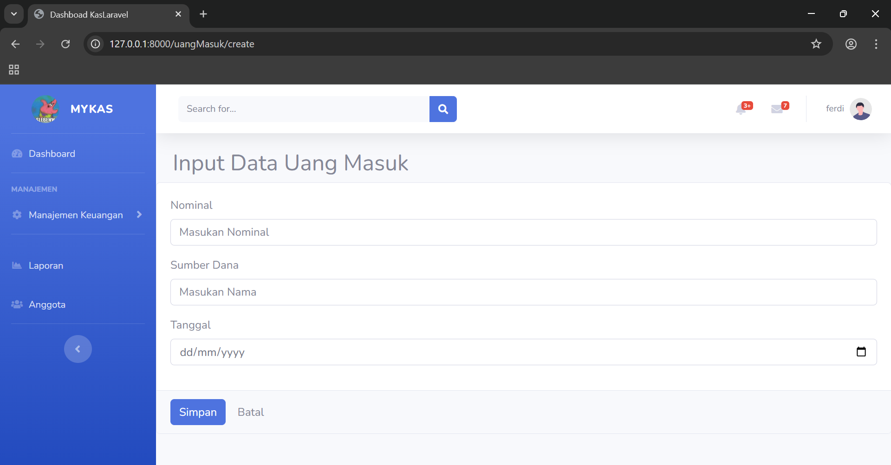
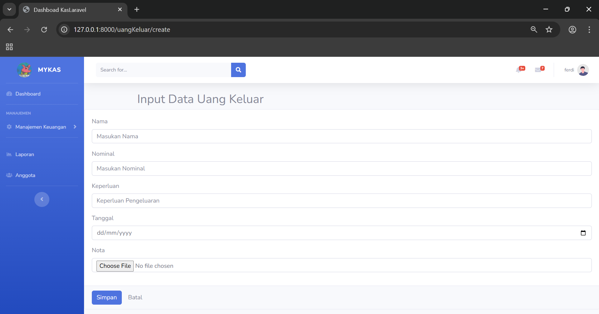

# Kas Laravel

Aplikasi kas sederhana berbasis Laravel. Proyek ini dirancang untuk membantu pengguna mencatat pemasukan dan pengeluaran dengan mudah dan efisien. Cocok digunakan oleh organisasi kecil, UKM, komunitas, atau kebutuhan pribadi.

## 🔧 Fitur Utama

-   CRUD data pemasukan dan pengeluaran
-   Dashboard ringkasan keuangan
-   Grafik laporan menggunakan Chart.js
-   Autentikasi user (login dan register)
-   Validasi input dan notifikasi error
-   Export laporan ke PDF
-   Responsive design

## 🚀 Teknologi yang Digunakan

-   Laravel
-   Vite
-   Tailwind CSS
-   Chart.js
-   MySQL

## 📦 Cara Instalasi

```bash
git clone https://github.com/anandoFerdi/kas-laravel.git
cd kas-laravel
composer install
npm install
cp .env.example .env
php artisan key:generate
```

## 📦 Setup database

Edit file **.env** sesuai pengaturan database lokal kamu, lalu jalankan:

```bash
php artisan migrate
npm run dev
php artisan serve
```

## 📸 Screenshot

[](contoh-tampilan/halaman-login.png)
[](contoh-tampilan/dashboard.png)
[](contoh-tampilan/halaman-pemasukan.png)
[](contoh-tampilan/halaman-pengeluaran.png)
[](contoh-tampilan/input-pemasukan.png)
[](contoh-tampilan/input-pengeluaran.png)

## 👨‍💻 Pengembang

-   anandoFerdi

## 📄 License

Project ini menggunakan lisensi MIT.
